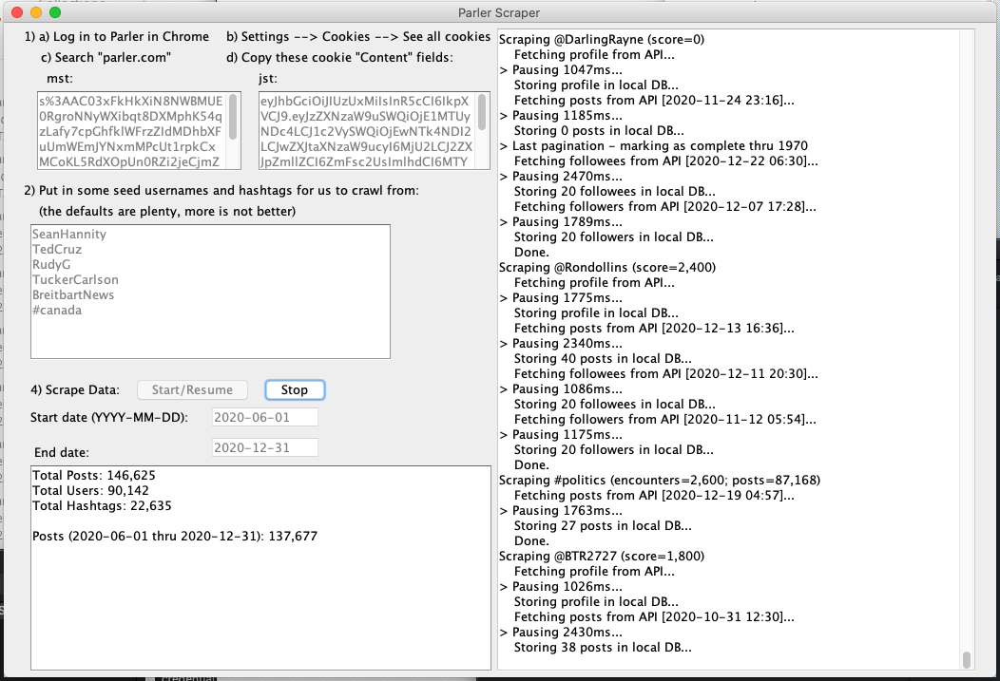

# ParlerScraper
ParlerScraper is a tool for scraping a pseudo-random sample of Parler posts. The main goal here is to make this data available for researchers.



This tool is provided AS-IS. It uses the internal, undocumented Parler API, and might stop working at any moment. US law generally protects reverse engineering non-public APIs so long as the purpose itself is legal (not, e.g., for bypassing a paid service), but laws may vary in your jurisdiction.

We make a best effort to provide a uniform, representative sample, but it's not currently possible to do so perfectly with the APIs available publicly. A nonexhaustive list of some sources of bias:

* The data early on in the sampling process is heavily biased by the initial seeds. It takes some time before a more representative sample is built. Between 100K-1M posts are probably necessary for most applications (about 1-14 days).
* Popular hashtags (and users who post A TON) get failed queries when querying far into the past. We thus only get posts from these for more recent days, biasing the overall data set toward recency. This is fairly negligible when scraping only users but will be substantial if you enable hashtag scraping. It is recommended that you only enable hashtag scraping for small, recent time ranges (e.g. the last week).
* If you sample hashtags, we bias toward more popular hashtags and hashtags which have not yet been scraped using heuristics.
* If we sample a reshare, we add both the reshare and the earlier, original post to the data set. This increases the chances of getting older posts and posts which have been reshared many times.
* If the end user samples over multiple date ranges, this can introduce lots of non-uniformity to the data set. It would generally be better to rename or delete the database and sample a new date range from scratch.
* We randomly select the time to scrape at with equal weight given to all times throughout the unscraped range. However, the Parler API then returns results from that time *and earlier*, giving a slight bias toward older posts. In practice this means the `end date - 1 week` or so may not be uniformly sampled. It would be best to add a week or two to the end date and then filter the resulting afterward.

Please analyze responsibly.

## Running a Scrape

### First Usage

1. In Chrome, log in to [https://parler.com/](https://parler.com/) (or visit it if you are already logged in)
2. Open Chrome's settings
3. Open "Cookies and Other Site Data"
4. "See all cookies and site data"
5. Search for "parler.com" 
6. Open the parler.com item 
7. Copy the mess of random characters from within `mst` and `jst` content fields to the corresponding boxes in the Parler Scraper tool

NOTE: If the `jst` cookie is missing, log out of parler and log back in, and repeat the above steps.

NOTE: Other browsers might format their cookies' content fields in different ways. We expect the format Chrome uses (i.e. urlencoded).

These steps should not need to be repeated unless the `mst` is invalidated (e.g. if you log out of Parler in the browser).

### Scraping a time range

1. Set the seeds you'd like to use, putting one on each line. This is what we initially scrape and then branch out across the Parler network from there. The defaults should generally be fine. Users should be in the form `username` and hashtags in the form `#hashtag`.
2. Type in your start and end dates you'd like to scrape. They are in the format YEAR-MONTH-DATE. (e.g. `2020-12-25` for 25 December, 2020). It would be a good idea to pad them a little bit (perhaps 1-2 weeks) on either side and then filter the sample after the fact to get a more uniform sample within the region you care about.
3. Adjust the ratio of users to hashtags which will be scraped. If set to 5:2, for example, we would scrape 5 users for every 2 hashtags.\
NOTE: Hashtag scraping should generally only be turned on when sampling very recent time ranges (e.g. last week) because the Parler API tends to crash when querying old hashtag dates, which will result in a non-uniform sample.
4. Click Start/Resume and it will run automatically until you turn it off.
5. The software can be turned off and restarted at any point in the future.

NOTE: Make sure you have a stable internet connection! The software does not currently distinguish between the API crashing and you not having internet, so it may mark valid time ranges as invalid if you lose connectivity.

### Saving the results

* The results are automatically saved in the file `parler_scraper_database.db` in the same directory as the software.
* If you want to do the equivalent of "Save as...", just copy the file somewhere else and rename it.
* You can also delete the file from the original location and restart the application to force it to do a new scrape from scratch, instead of adding to existing data.
* You can also manually delete all of the scrape ranges where `scrape_successful=1` as well as all of the posts using a tool like "DB Browser for SQLite". This will give the software lots of user and hashtag seeds to choose from and also prevents it from trying to scrape hashtags and users from time ranges which we know cause the API to crash, while still giving you a fresh random sample.

## Accessing the Results

### DB Browser for SQLite

1. Download [DB Browser for SQLite](https://sqlitebrowser.org/)
2. File → Open Database (or Open Database Read Only)
3. Select `parler_scraper_database.db`
4. Click "Browse Data" and select the table you'd like to look at

NOTE: Usage while scraping could cause the DB Browser to crash (the scraper itself will show an error message in the log and retry until it succeeds).

### Python + Pandas

There are multiple examples in [python_example.py](python_example.py) for getting the data into Pandas dataframes.

### Other Languages

Most languages have libraries for accessing SQLite databases. Find one for your language. You can generally use the SQL queries from the Python example in those libraries as well.

## Parler API Internals

### Parler Times

Parler stores times in one of two formats:

*   Compressed − This is the main format used within their API for, e.g., creation times. It is the year, month, day, hour (0-23), minutes, seconds \
e.g. `20200624154405`
*   Extended − These are used as pagination keys in the Parler API. It is a UTC ISO8601 Timestamp with an underscore and an additional number. It is not totally clear what the purpose of the additional number is, but they appear to be monotonically increasing within a context (e.g. post paginations) since mid-2019. Exceptions exist before that. This suggests that each action might increase a global counter which is then used for pagination key deduplication. This is just an educated guess and right now setting it to `0` when issuing API requests seems to work just fine.\
e.g. `2020-10-23T18:04:50.105Z_159130735`

### Parler Numbers

Parler numbers are often returned in the form `3.2m` (i.e. 3.2 million) in the API. We transform this to an integer with low precision in the database (e.g. `3200000`) for ease of comparison.

### Parler Session Cookies

Parler uses two session cookies - `mst` and `jst`. These are the long-lived and short-lived tokens, respectively. The `mst` will remain stable for a few months while the `jst` is rotated every few minutes. We automatically handle this rotation and store the latest tokens in the `credentials.txt` file.

## Database Columns

Keep in mind that most of these descriptions are educated guesses. There is no official documentation. If you discover evidence of a more accurate description, please either open an Issue or create a Pull Request with the README correction.

### Users

* `fully_scanned` (boolean: `0` or `1`)\
Has ParlerScraper fully scanned this user yet? Many fields will be missing if not
* `id` (e.g. `4b8638eca2db4b17b3a7203e40ac8ce7`)\
The unique ID used to represent the user in Parler's databases
* `account_color` (e.g. `#a50202`)\
Color of the user's profile
* `badges` (e.g. `[0,2]`)\
A json list of integers corresponding to badges on users' profiles. Here are what the numbers correspond to (with descriptions copied from Parler's website):
  * 0 - Verified Real Member: Parler Citizens are verified unique people in the Parler network. This does not mean the person is who they claim to be, just that they are Real People
  * 1 - Verified Influencer: People with a large following who have the potential to be targeted for impersonation, hacking or phishing campaigns. This badge is to protect the person’s authenticity and prove their identity to the community.
  * 2 - Parler Partner: Publisher uses Parler Commenting to import all articles, content and comments from their website community.
  * 3 - Parler Affiliate: Affiliates permit Parler to import articles directly from their website.
  * 4 - Private Account: Private accounts will only allow approved followers to see their Parleys\
  NOTE: These almost always have `private_account=1`, but rarely `private_account=0` - in this case the user has a private badge but their posts are still publicly visible. This is probably a Parler bug and might indicate users who think they are private but aren't actually because their settings didn't save correctly. This data can be scrubbed using these sql commands:
  ```
  DELETE FROM posts
  WHERE creator_id IN (
	  SELECT id
	  FROM users
	  WHERE
		  badges LIKE '%4%'
		  AND private_account=0
  );

  DELETE FROM users
  WHERE
	  badges LIKE '%4%'
	  AND private_account=0;
  ```
  * 5 - Real Member Restricted Comments Badge: Are verified unique people in the Parler network. This does not mean the person is who they claim to be, just that they are Parler Citizens. The darker badge color indicates they restrict communications to other Parler Citizens.
  * 6 - Parody Account: A comical depiction of a high profile individual
  * 7 - Parler Employee: An employee of Parler
  * 8 - Real Name: This is a verified Parler Citizen who is using their real name as their display name
  * 9 - Early Parley-er: This individual joined Parler and was active very early in Parler's life.
* `banned` (boolean: `0` or `1`)\
Whether or not this user has been banned
* `bio` (e.g. `Father of 2. Lover of God #maga #trump2020`)\
The user's bio on their profile
* `blocked` (boolean: `0` or `1`)\
Whether or not you have blocked this user
* `comment` (e.g. `39000`)\
Number of comments made by this user
* `cover_photo` (e.g. `a0a488d502af4fb0b383f0261c9a5793`)\
Parler ID of the user's cover photo
* `followed` (boolean: `0` or `1`)\
Do you follow this user?
* `followers` (e.g. `39000`)\
The number of people who follow this user
* `following` (e.g. `39000`)\
The number of people this user follows
* `human` (boolean: `0` or `1`)\
This seems to be identical to Badge 0
* `integration` (boolean: `0` or `1`)\
This seems to be identical to Badge 2
* `interactions` (e.g. `6247`)\
This used to be a bitfield of permitted interactions. It seems to always be 0 after the February 2021 relaunch. The following is preserved for historical reasons. These are the names of the fields for each bit within the Android app (when they exist) as well as functions in iOS which return true if this bit is true:
  * 0 - ACCEPTS_TIPS - `userCanRecieveTip` in iOS
  * 1 - STATIC_FEEDS
  * 2 - DARK_PARLEY - This seems to be the internal name for "Influencer Campaigns"
  * 3 - INFLUENCE_DISABLED
  * 4 - INFLUENCE_ADMIN_DISABLED
  * 5 - IAA_PERMITTED - `canModerate()` in iOS
  * 6 - IAA_BANNING - `canBan()` and `canBlockUrl()` in iOS
  * 7 - SELF_SENSITIVE
  * 8 - NO_SENSITIVE - `nsfwFilterON()` in iOS
  * 9 - SENSITIVE_LOCKOUT
  * 10 - ADMIN_SENSITIVE
  * 11 - ADMIN_DISCOVER
  * 12 - Not found in Android - `canBan()` in iOS
  * 13 - Unclear (@Marklevinshow is the only example I can find)
  
  These can be obtained in Python using code like the following: `iaa_banning = ((interactions >> 6) & 1) > 0`, replacing the `6` with the index of whichever field you are looking for. There is also a sql example in [python_example.py](python_example.py).
* `is_following_you` (boolean: `0` or `1`)\
Whether or not this user follows you
* `joined` (e.g. `20200624154405`)\
When the user joined
* `likes` (e.g. `88`)\
Probably number of things this user has liked (it does not seem to match up with the number of likes on their content)
* `media` (e.g. `286`)\
Number of media (pictures, videos) the user has produced
* `muted` (boolean: `0` or `1`)\
Whether or not you have muted this user
* `name` (e.g. `John Smith`)\
The user's name
* `pending_follow` (boolean: `0` or `1`)\
Have you requested to follow this private account?
* `posts` (e.g. `32000`)\
The number of posts this user has made
* `private_account` (boolean: `0` or `1`)\
Whether or not this user is a private user. See Badge 4 for more commentary.
* `profile_photo` (e.g. `f4b5aaf2bfc44ac1ae537f52a0f1fa1c`)\
Parler Id of their profile photo
* `rss` (boolean: `0` or `1`)\
This seems to be identical to Badge 3
* `score` (e.g. `1200`)\
Some kind of internal Parler score. Higher scores generally correspond to more popular users (e.g. Sean Hannity) while negative scores often correspond to anti-conservative accounts (e.g. `@FuckUDonaldTrump`)
* `state` (e.g. `2`)\
Unclear - Usually null but sometimes a number between 1 and 5. I couldn't find an obvious pattern.
* `subscribed` (boolean: `0` or `1`)\
Whether or not you are subscribed to this user. NULL if you do not follow them.
* `username` (e.g. `SeanHannity`)\
The user's username.\
NOTE: These are NOT 100% UNIQUE. I have encountered at least one case where duplicate usernames exist - two "@JbriggeRfp"s were created within 1 second of each other with different ids - suggesting there is a bug in Parler user creation, probably some kind of race condition. See these example users [here](https://gist.github.com/daniel-centore/33fa20ae42bb75fc4c91c4ff863eac5e).\
It may also be possible for a deleted user's username to be reused by someone else, but I have not made any effort to confirm this.
* `verified` (boolean: `0` or `1`)\
This seems to be identical to Badge 1
* `verified_comments` (boolean: `0` or `1`)\
This seems to be identical to Badge 5

### Posts


* `id` (e.g. `e19adc0b20fe4641961cd9bbb1d3cf78`)\
Parler's internal id for the post
* `article` (boolean: `0` or `1`)\
Whether or not it's an article
* `body` (e.g. `We need @chiproytx back in Congress! #tx21`)\
The body of the post
* `comments` (e.g. `1700`)\
Number of comments on the post
* `created_at` (e.g. `20201023202139`)\
When the post was created\
NOTE: Posts from imported accounts (e.g. `integration=1` or `rss=1`) can be dated to before Parler existed and before the account creation date. [Here's an example](https://parler.com/post/0940f0702765e225428eade006f7fcc5).
* `creator_id` (e.g. `4b8638eca2db4b17b3a7203e40ac8ce7`)\
Parler Id of the user who created the post
* `depth` (e.g. `4`)\
A string version of depth_raw. I have no examples of them differing and it's unclear why there is both a string and int version.
* `depth_raw` (e.g. `4`)\
A share has a depth of 0. A reshare has a depth of 1. A reshare of a reshare has a depth of 2. Etc. For depth 1, the `parent_id` is set but not the `root_id`. For `depth >= 2`, the `parent_id` represents what this post is a reshare of and the `root_id` represents the very first post shared in the chain.
* `hashtags` (e.g. `["maga2020","maga","electionintegrity"]`)\
A json list of hashtags used in the post
* `impressions` (e.g. `12000`)\
The number of times this post has been seen
* `link_ids` (e.g. `["4oLgv","li4yZ"]`)\
A list of the ids for all the links used in the post
* `mentions` (e.g. `{"teamtrump":"64ebc91ab5df4b768c37c21cc8a9e639","dbongino":"823acd76fe299a9a98851c9cdad78df5"}`)\
A json dictionary from username to parler id for all mentions in the body
* `parent_id` (e.g. `9d4ad644ca16496b9f3c7730ee0de192`)\
The id of the post that this is a reshare of, or NULL if it is not a reshare
* `preview`\
A shortened version of body (e.g. `We need @chiproytx back`)
* `reposts` (e.g. `258`)\
The number of times this has been reposted
* `root_id` (e.g. `10131a54d6074b7e95470727555ec865`)\
When `depth` >= 2, this is the original post in a chain of reshares. Otherwise, null.
* `sensitive` (boolean: `0` or `1`)\
Nominally setting this to `1` means that the content can only be viewed if "Hide Sensitive Content" is manually turned off in the Moderation pane under the hamburger menu. Even when I adjust this setting though, I still can't view the content, with an error saying it's sensitive. However, reshares of the post are visible either way. Wtf.
* `share_link` (e.g. `https://parler.com/post/b726e8115d8948f3a72481d3a8f69be6`)\
The link used within the share button. This is often null; the share button is missing in this case. However, even when this is null, going to `https://parler.com/post/`{id} let's you view the post.
* `state` (e.g. `4`)\
Unclear. Almost always 4. Sometimes null or 7.
* `trolling` (boolean: `0` or `1`)\
Unclear. This did not exist before the February 2021 relaunch but existed after it.
* `upvotes` (e.g. `64000`)\
The number of times this post has been upvoted

### Links

Note: Each link includes a large amount of metadata in many, many forms. We include the fields which show up most often in the `metadata_` columns, but this is not an exhaustive collection of the data about the link that the API provides.

* `link_id` (e.g. `h4KNA`)\
Parler's internal id for the link. Used in the `links` column in the `posts` table.
* `created_at` (e.g. `20201021182356`)\
When the link was first created
* `domain` (e.g. ` hannity.com`)\
Domain of the link
* `long_url` (e.g. `https://hannity.com/media-room/go-ahead-and-trump-singer-releases-incredible-trump-anthem-to-the-tune-of-van-halens-jump/?utm_source=socialflow`)\
The full URL
* `metadata_description` (e.g. `Senator Kamala Harris raised the eyebrows of voters across the United States this week when she claimed the Coronavirus is responsible for 220...`)\
A description of the link from the website itself
* `metadata_image` (e.g. `https://hannity.com/wp-content/uploads/2019/01/border_sandiego.jpg`)\
The image used for the link
* `metadata_length` (e.g. `194441`)\
Filesize in bytes. Often 0, -1, or NULL
* `metadata_locale` (e.g. `en_US`)\
Locale of the website
* `metadata_mime_type` (e.g. `text/html`)\
Mime type of the link
* `metadata_site` (e.g. `@realDailyWire`)\
Seems to often be the twitter handle associated with the website, but there are many exceptions
* `metadata_site_name` (e.g. `The Daily Wire`)\
Name of the website
* `metadata_title` (e.g. `Donate - chip Roy for Congress`)\
Title of the page
* `metadata_type` (e.g. `article`)\
Type of link
* `metadata_url` (e.g. `https://hannity.com/media-room/go-ahead-and-trump-singer-releases-incredible-trump-anthem-to-the-tune-of-van-halens-jump/?utm_source=socialflow`)\
The full URL. Usually matches `long_url` but not 100% of the time. Unclear why.
* `metadata_video` (e.g. `https://www.youtube.com/embed/avvizVs4AV4`)\
The embed link for videos
* `modified_url` (e.g. `youtu.be/avvizVs4AV4`)\
Shortest URL from the service itself
* `short_url` (e.g. `https://par.pw/l/Pn7Yh`)\
Parler provided shortned URL
* `status` (e.g. `FAILED_STATUS_404`)\
What the status was when fetched. Usually `VALID`.

### Hashtags

* `hashtag_lowercasase` (e.g. `maga`)\
A lowercase version of the hashtag
* `total_posts` (e.g. `129472`)\
The total number of posts present in this hashtag
* `encounters` (e.g. `233`)\
The number of times we encountered this post while scraping. This is used for estimating the number of total posts for hashtags which we have not yet scraped\
Note: this is sometimes larger than total_posts if we encountered a post multiple times. It does not deduplicate.

### Scraped Ranges

This table represents every API call made to a paginating surface (e.g. a user's posts or a hashtag search). These API calls are issued with a start time and the API response includes what the next pagination key should be to retrieve the next pagination. We record both of these times and use them to avoid scraping within that region again.

If an API call fails, as it often does for popular hashtags more than ~1 month in the past, we record scrape_end as a unix time of 0 (i.e. `1970-01-01T00:00:00.000Z_0`), which prevents us from from trying to scrape that entity again from the start point and earlier. If that entity is selected again, the random scrape time will be after the maximum failed scrape_start.

* `id` (e.g. `12`)\
This goes up by 1 with each scrape
* `scrape_end` (e.g. `2020-11-19T08:07:20.564Z_391310645`)\
The timestamp the API wanted us to use for the next pagination (this will be earlier than scrape_start). If `scrape_successful=0`, this is set to `1970-01-01T00:00:00.000Z_0`
* `scrape_start` (e.g. `2020-11-19T08:09:06.519Z_0`)\
The timestamp which this scrape was initiated at via the API
* `scrape_successful` (boolean: `0` or `1`)\
Whether or not we successfully scraped. Usually when this is 0 it's because the API timed out. We use this as a mechanism for no longer trying to query the API for that time or earlier for a particular scraped_id/scraped_type combo.
* `scraped_id` (e.g. `980cd893fcdac62a5368a4c399e5404a`)\
Context specific unique id for the thing we scraped (e.g. parler id for users, hashtag for hashtags)
* `scraped_type` (e.g. `USER_FOLLOWEES`)\
The type of thing which was scraped
* `scrape_timestamp` (e.g. `2020-12-29T14:40:24.827Z_0`)\
The time at which we performed this scrape.Just for logging − it might be useful if, e.g., you lose internet and need to delete a bunch of failed scrapes so those ranges can be up for consideration again.

## Contributing
This is an Eclipse project. Just import it into Eclipse to edit.

If you're working on the GUI, import the project into Netbeans and edit the GUI there.
